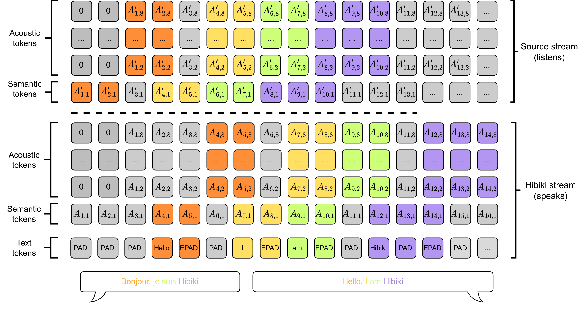
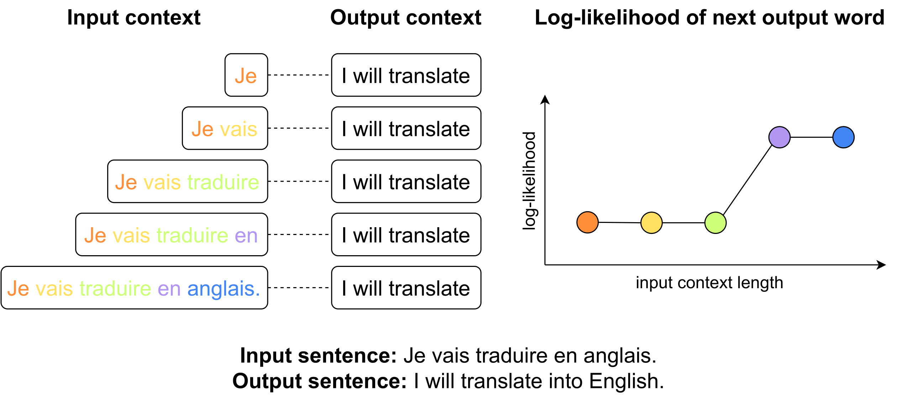
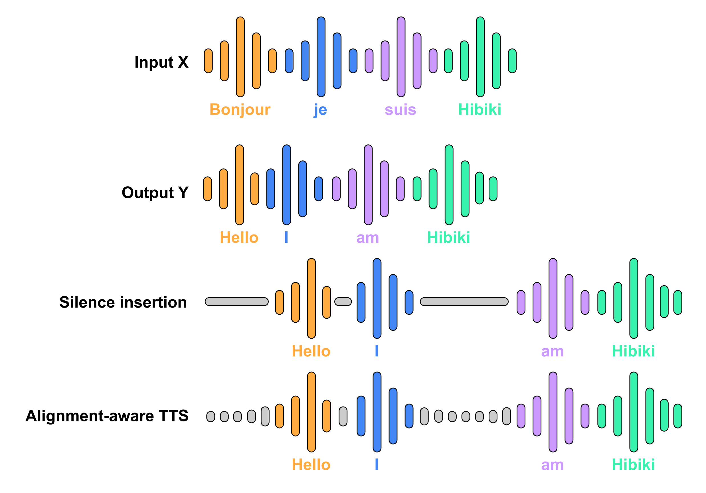

# Hibiki: High-Fidelity Simultaneous Speech-To-Speech Translation

[[Read the paper]][hibiki]
[[Samples]](https://huggingface.co/spaces/kyutai/hibiki-samples)
[[HuggingFace]](https://huggingface.co/kyutai/hibiki-2b-pytorch-bf16)
<a target="_blank" href="https://colab.research.google.com/drive/1as2BL2M54ZCYJkSdVYIuRLSW_K305Fye?usp=sharing">
  
</a>

## Description

### What is Hibiki?
Hibiki is a model for **streaming speech translation** (also known as
*simultaneous* translation). Unlike offline translation—where one waits for the end of the source utterance to start
translating--- Hibiki **adapts its flow** to accumulate just enough context to produce a correct translation in real-time,
chunk by chunk. As the user speaks, Hibiki generates natural speech in the target language,
optionally with voice transfer, **along with a text translation**.

### Architecture
Hibiki is a decoder-only model for simultaneous speech translation. Hibiki leverages the **multistream** architecture of
[Moshi](https://arxiv.org/abs/2410.00037) to model source and target speech jointly. This allows Hibiki
to continuously process the input stream while generating the target speech. Hibiki produces text and audio tokens
at a constant framerate of 12.5Hz. This allows for a continuous output audio stream, along with timestamped text translation.

<p align="center">
</p>

### How is it trained?

Hibiki relies on supervised training of aligned source speech and target speech and text, from the same speaker.
Such data does not exist in significant amounts so we rely on synthetic data generation. Word-level matching is made
between source and target transcripts using a *contextual alignment* weakly-supervised method that leverages an
off-the-shelf [MADLAD](https://huggingface.co/google/madlad400-3b-mt) machine translation system. The derived alignment
rule (a word should only appear in the target once it's predictable from the source) is applied either by inserting
silences or by synthesizing targets with a voice controlled, alignment-aware TTS.

<div style="display: flex; align-items: center; justify-content: center;">
  
  
</div>

### Inference
At inference, Hibiki continuously encodes source speech and produces target speech. Hibiki relies on simple
temperature sampling and is thus compatible with batching unlike models that rely on complex
inference policies. Moreover, the fidelity of Hibiki's voice transfer can be controlled by changing the coefficient of
the Classifier-Free Guidance: a larger coefficient will increase voice similarity, but excessive coefficients can lead
to worse translations. Hibiki currently only supports French-to-English translation. Its smaller alternative, Hibiki-M
can run locally on smartphone hardware. Current models were trained on sequences up to 120 seconds and use a context
size of 40 seconds.

## Running the model

We provide inference code for PyTorch, Rust, MLX for macOS, and MLX-swift
for iOS.

### PyTorch

In order to translate an audio file using Hibiki/PyTorch, install the
`moshi` package via.
```bash
pip install -U moshi
```

Then you can retrieve some sample files from [kyutai-labs/moshi](https://github.com/kyutai-labs/moshi/tree/main/data)
and translate them via the following:
```bash
wget https://github.com/kyutai-labs/moshi/raw/refs/heads/main/data/sample_fr_hibiki_crepes.mp3
python -m moshi.run_inference sample_fr_hibiki_crepes.mp3 out_en.wav --hf-repo kyutai/hibiki-1b-pytorch-bf16
```


You can specify some classifier-free guidance using the `--cfg-coef` parameter.
The default value is 1, the higher the value, the closer the generated voice
should be to the original voice. A typical value to use is 3.

### MLX

In order to translate an audio file using Hibiki/MLX, install the
`moshi_mlx` package via the following command. You need at least version `0.2.1`
of this package.

```bash
pip install -U moshi_mlx
```

Then you can retrieve some sample files from [kyutai-labs/moshi](https://github.com/kyutai-labs/moshi/tree/main/data)
and translate them via the following:
```bash
wget https://github.com/kyutai-labs/moshi/raw/refs/heads/main/data/sample_fr_hibiki_crepes.mp3
python -m moshi_mlx.run_inference sample_fr_hibiki_crepes.mp3 out_en.wav --hf-repo kyutai/hibiki-1b-mlx-bf16
```

You can specify some classifier-free guidance using the `--cfg-coef` parameter.
The default value is 1, the higher the value, the closer the generated voice
should be to the original voice. A typical value to use is 3.

### MLX-Swift

The [kyutai-labs/moshi-swift](https://github.com/kyutai-labs/moshi-swift) repo
contains a MLX-Swift implementation that can run on an iPhone. This was tested
on an iPhone 16 Pro. Note that this code there is very much experimental.

### Rust

More instructions to come soon.

## Models

We release two models for `FR -> EN` translation:
- Hibiki 2B (for the backbone, a bit more with the depth transformer), 16 RVQ per stream.
- Hibiki 1B (for the backbone, a bit more with the depth transformer), 8 RVQ per stream, ideal for on device inferencde.

Depending on the backend, the file format will vary.  Quantized models coming up soon. Current list of models:
- Hibiki 2B for PyTorch (bf16): [kyutai/hibiki-2b-pytorch-bf16](https://huggingface.co/kyutai/hibiki-2b-pytorch-bf16)
- Hibiki 1B for PyTorch (bf16): [kyutai/hibiki-1b-pytorch-bf16](https://huggingface.co/kyutai/hibiki-1b-pytorch-bf16)
- Hibiki 2B for MLX (bf16): [kyutai/hibiki-2b-mlx-bf16](https://huggingface.co/kyutai/hibiki-2b-mlx-bf16)
- Hibiki 1B for MLX (bf16): [kyutai/hibiki-1b-mlx-bf16](https://huggingface.co/kyutai/hibiki-1b-mlx-bf16)

All models are released under the CC-BY 4.0 license.


## License

The present code is provided under the MIT license for the Python parts, and Apache license for the Rust backend.
The web client code is provided under the MIT license.

The weights for the models are released under the CC-BY 4.0 license.

## Citation

If you use Hibiki, please cite the following paper,

```
@misc{kyutai2025hibiki,
      title={High-Fidelity Simultaneous Speech-To-Speech Translation},
      author={Tom Labiausse and Laurent Mazar\'e and Edouard Grave and
      Patrick P\'erez and Alexandre D\'efossez and Neil Zeghidour},
      year={2025},
      eprint={2502.03382},
      archivePrefix={arXiv},
      primaryClass={cs.CL},
      url={https://arxiv.org/abs/2502.03382},
}
```


[hibiki]: https://arxiv.org/abs/2502.03382
